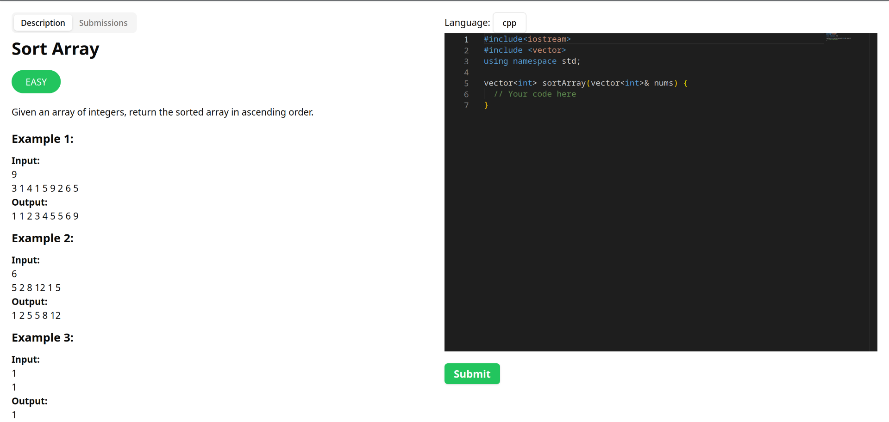

# 🧑‍💻 Leetcode

> Coding practice platform

## 🌐 Live Demo

[https://leetcode.namanarora.xyz](https://leetcode.namanarora.xyz)



## ⚙️ Tech Stack

1. 🌐 Frontend

    - ⚛️ React
    - 🔷 Typescript
    - 📝 Monaco Editor
    - 🎨 Shadcn UI
    - 📨 React Query

2. 🛜 Backend

    - 🪹 Nest JS
    - 🔷 Typescript
    - 🐋 Docker
    - 📗 Prisma
    - 🐘 PostgreSQL

## 📁 Project Structure

```
.
├── assets
│   └── leetcode.png
├── client
│   ├── public/
│   ├── src
│   │   ├── api/
│   │   ├── components/
│   │   ├── lib/
│   │   ├── pages/
│   │   ├── styles/
│   │   ├── utils/
│   │   ├── App.tsx
│   │   └── main.tsx
│   ├── .env.example
│   ├── components.json
│   ├── eslint.config.js
│   ├── index.html
│   ├── package.json
│   ├── postcss.config.js
│   ├── tailwind.config.js
│   ├── tsconfig.app.json
│   ├── tsconfig.json
│   ├── tsconfig.node.json
│   ├── vercel.json
│   ├── vite.config.ts
│   └── yarn.lock
├── server
│   ├── prisma/
│   ├── src
│   │   ├── auth/
│   │   ├── common/
│   │   ├── config/
│   │   ├── modules/
│   │   ├── prisma/
│   │   ├── shared/
│   │   ├── app.module.ts
│   │   └── main.ts
│   ├── test/
│   ├── typings/
│   ├── .env.example
│   ├── nest-cli.json
│   ├── package.json
│   ├── tsconfig.build.json
│   ├── tsconfig.json
│   ├── typings
│   └── yarn.lock
├── .gitignore
├── LICENSE
└── README.md
```

## 🚶🏻‍♂️ Getting started and 🏃🏻‍♂️ Running the app

### Clone the repo

```bash
$ git clone https://github.com/naman22a/leetcode
$ cd leetcode
```

### Server setup

-   Install NodeJS
-   Install PotgreSQL and create a database named leetcode
-   Install Redis
-   Install Docker

```bash
$ cd server
$ cp .env.example .env # add env variables
$ yarn install
$ yarn prisma migrate dev
$ yarn dev
```

### Client setup

-   Install NodeJS

```bash
$ cd client
$ cp .env.example .env # add env variables
$ yarn install
$ yarn dev
```

## 🤝 Contributions

Contributions, issues, and suggestions are welcome! Feel free to fork the repository and submit pull requests.

## 📫 Stay in touch

-   Author - [Naman Arora](https://namanarora.xyz)
-   Twitter - [@naman_22a](https://twitter.com/naman_22a)

## 🗒️ License

Leetcode is [GPL V3](./LICENSE)
